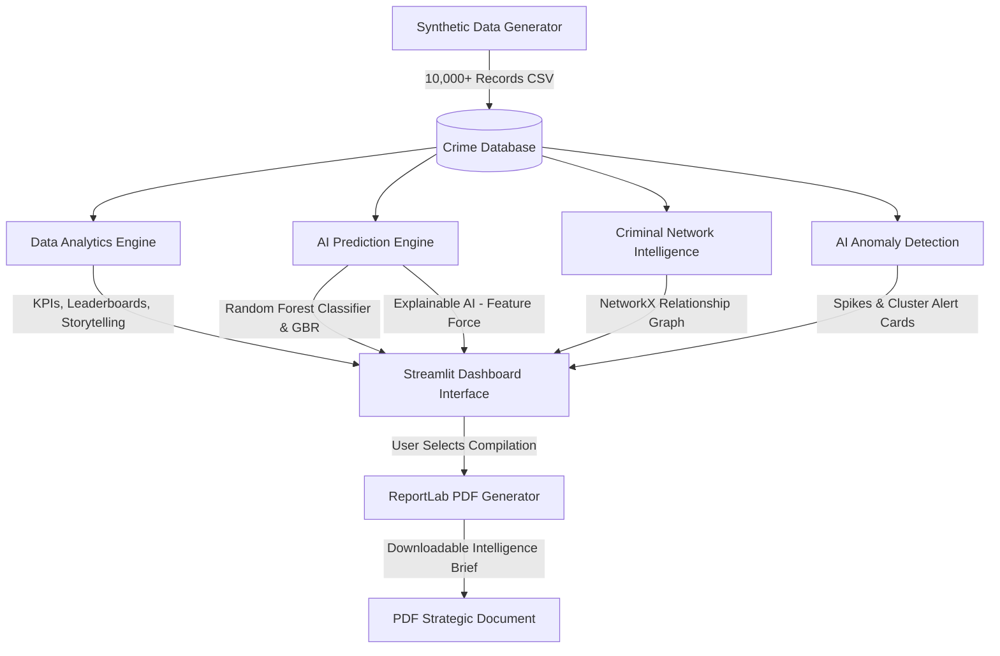

# CrimeVision AI: Predict. Analyze. Protect.

**CrimeVision AI** is a production-quality, hackathon-ready Crime Intelligence and Predictive Policing Platform designed for the Karnataka State Police. Built by team **Smart Predictors**, the platform transforms raw crime records into real-time, actionable insights using Machine Learning, Geospatial Analysis, Criminal Network Graphs, and Explainable AI (XAI).

---

## 🏗️ System Architecture



---

## 🌟 Core Features

1. **Crime Analytics Dashboard**: Displays 7 vital KPIs (Total Crimes, Active Cases, Solved Cases, High Risk Cases, Repeat Offenders, Growth Rate, Severity Index) and interactive distribution graphs with multi-level filtering.
2. **Crime Hotspot Intelligence Map**: Features an interactive Folium Map showing density heatmaps and severity markers (Red=High Risk, Orange=Medium Risk, Green=Low Risk).
3. **Crime Trend Discovery**: Dynamic temporal charts demonstrating time-of-day peak volumes, weekday vs weekend workloads, and automatic seasonal trend briefings.
4. **AI Crime Prediction Engine**: Predicts future crime volume via a Gradient Boosting Regressor and incident-level risk scores via a Random Forest Classifier.
5. **AI Risk Scoring System**: Generates a 0-100 gauge score for districts, police stations, and specific incident configurations.
6. **Criminal Network Intelligence**: Uses NetworkX and Plotly to construct interactive networks showing Suspect, Incident, Victim, and Station nodes with centrality indices to isolate recidivists.
7. **AI Anomaly Detection**: Tracks daily crime filings against Z-score deviations (> 2.0 std dev) to alert commanders of sudden local crime spikes.
8. **Explainable AI (XAI)**: Demystifies predictions by presenting positive/negative feature contribution forces and global model feature importances.
9. **Strategic Recommendations**: Produces automated, data-driven policing directives, advising on force deployments and public awareness efforts.
10. **Natural Language Storytelling**: Translates numeric trends into executive-level situational narratives.
11. **District Leaderboard**: Ranks the top 10 Karnataka districts by risk levels, crime numbers, growth rates, and severity indices.
12. **Emerging Crime Alert Center**: Live dashboard alerts warning of newly forming hotspots, active repeat offenders, or rising cybercrime categories.
13. **PDF Intelligence Report Generator**: Compiles dashboard statistics, risk scores, forecasts, and recommendations into a printable report with a single click.

---

## 📁 Folder Structure

```
CrimeVision AI/
│
├── data/
│   └── synthetic_crime_data.csv   # Automatically generated on first run
│
├── src/
│   ├── __init__.py                # Package initializer
│   ├── data_generator.py          # Synthetic dataset engine (10,000+ rows)
│   ├── analytics.py               # Analytical math, KPIs, and leaderboards
│   ├── models.py                  # ML models, classifiers, and SHAP estimators
│   ├── network_analysis.py        # NetworkX structures & Plotly visuals
│   ├── report_generator.py        # ReportLab PDF compiler
│   ├── recommender.py             # NLP recommendations and storytelling
│   └── utils.py                   # Anomaly calculations & custom styling
│
├── app.py                         # Streamlit UI dashboard
├── requirements.txt               # Dependencies
└── README.md                      # Documentation
```

is**: Integrate graph neural networks (GNN) to automatically forecast gang expansion probabilities.
- **Multilingual NLP**: Support local languages (e.g., Kannada) in reports and storytelling narrative blocks.
